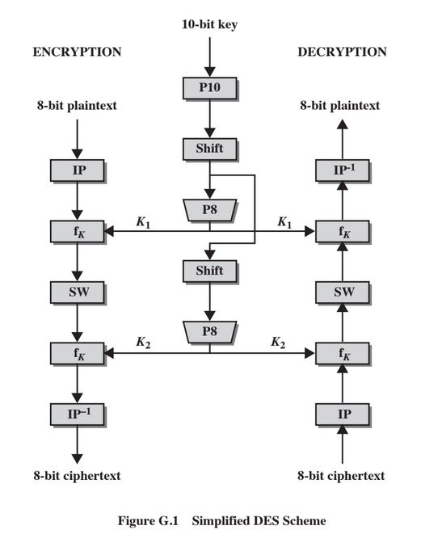

# Implémentation en C++ de l’algorithme de chiffrement S-DES

On utilise la classe "bitset" qui nous permet d'imiter un tableau d'éléments bool, mais en optimisant l'allocation d'espace. Les sous-fonctions sont donc optimales, elles utilisent des opérations bit à bit.

