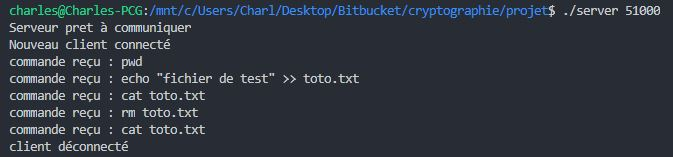
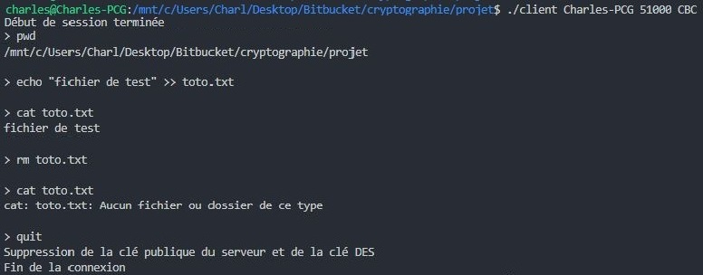

## Présentation

Les programmes vont permettre à un (ou plusieurs) client d'executer des commandes sur la machine du serveur (de manière relativement similaire à du ssh). Le client va demander à l'utilisateur d'entrer des commandes qui seront transmises au serveur qui, lui, retournera le résultat de la commande (stdout et stderr).

Voici un exemple d'exécution du programme :

\newpage

## Compilation

Les programmes ont été réalisés en C++, un makefile est mis à disposition pour la compilation.

Il est nécessaire d'avoir installé la version de developpement d'openssl (libssl-dev sous Debian, Ubuntu) pour pouvoir exécuter le programme. Cette dernière est essentielle pour la création et l'utilisation des clés RSA par le serveur.

    sudo apt install libssl-dev

## Exécution

Après la compilation deux exécutables sont créés : server et client.

Le serveur ne nécessite qu'un numéro de port en paramètre pour être lancé.

    ./server 51000

Une fois que le serveur lancé et qu'il a terminé de généré les clés RSA et la configuration du socket, il est possible de s'y connecter via la programme client.

Le client nécessite trois paramètres : le hostname du serveur, le port et le mode de communication (ECB ou CBC)

    ./client hostname-serveur 51000 CBC

Une fois les échanges de début de session terminés, le client peut désormais transmettre des commandes (chiffrées) au serveur.

\newpage

## Fonctionnement

Le serveur peut gérer plusieurs clients de façon totalement indépendante. En effet, à chaque nouvelle connexion, le serveur va créer un processus (fork) qui sera chargé des communications avec le nouveau client. Ainsi, chaque processus sur le serveur correspond à un client.

Les clés RSA ne sont générées qu'une seule fois lors du lancement du serveur. La clé publique sera ensuite simplement transmise à chaque nouvelle connexion avec un client afin que ce dernier puisse transmettre sa clé DES de façon sécurisée.

Nous avons implémenté deux modes de communications : ECB et CBC. Le choix du mode à utiliser est fait par le client. Le serveur va donc s'adapter à chacun d'eux. Il est ainsi possible d'avoir deux clients (ou plus) avec deux modes différents sur le même serveur.

Le client peut quitter en exécutant la commande "quit". Cette dernière va, avant de terminer le programme, supprimer le clé RSA publique ainsi que la clé DES. Cette commande sera également envoyée au serveur qui terminera le procesus qui se chargeait de la communication avec ce dernier.

Concernant l'implémentation du DES, nous avons choisi d'utiliser des "bitset" disponibles en C++. Ces derniers permettent de manipuler des bits simplement et efficacement (chaque bit prend exactement 1 bit en mémoire).

La communication entre le serveur et les clients se fait via des sockets et des buffers de 640 octets (la taille pouvant être modifiée dans le fichier socket.h).
